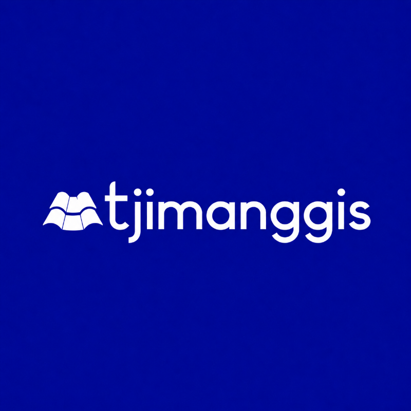

# Halo!! Ahlan wa Sahlan, Kawan! 👋

  

## ☕ Tentang Kita

Halo! Kami adalah **Tjimanggis**, sekumpulan anak-anak ma'had yang bermimpi untuk membuat sebuah project website atau aplikasi yang nanti dapat bermanfaat bagi ummat.

---

## 🛠️ Senjata Tempur 

Biar dibilang kaya *developer* beneran, ini alat lengkap yang biasa kita pake dari *frontend*, *backend*, hingga *database*:

*   **Tech Stack:** `HTML`, `CSS`, `JavaScript`, `TypeScript`, `React`, `Vite`, `Node.js`, `Supabase`, `Tailwind CSS', dan masih banyak lainnya.
*   **Tools Sehari-hari:** `VS Code`, `Git`, `GitHub`, dan tekad yang kuat ✨

  

---

## Btw kita juga minta maaf kalau codingan kita belum sempurna,soalnya kita masih vibe coding dan masih belajar,jadi mohon dimaklumi Kawan.

## 🤙 Kontak & Dukungan

  Kaau Mau tahu, mau kenalan, mau ngobrol seputar kodingan, atau mau traktir kopi biar kita makin semangat ngoding? Langsung klik tautan di bawah ya!

  
  &nbsp;&nbsp;&nbsp;

  <em>"Syukron"</em>

